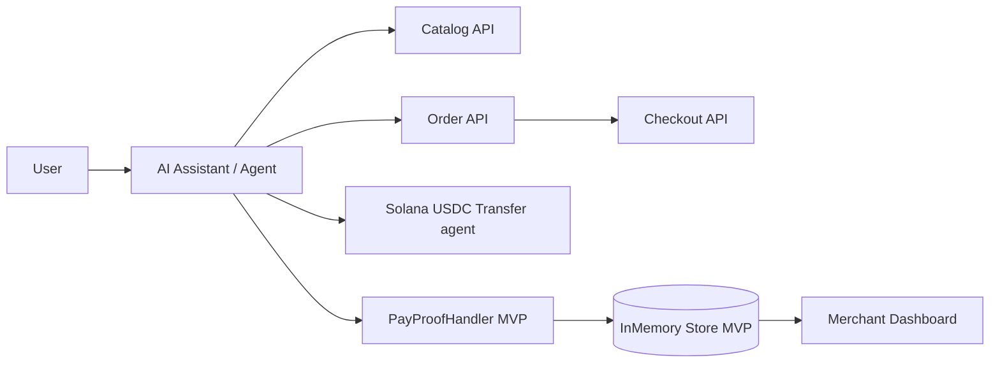

<div align="center">

# M.A.X.I.S.

### **M**odel-**A**gnostic **eX**change **&** **I**nventory **S**tandard

**Local businesses, agent-readable commerce, x402 checkout, USDC settlement on Solana**

[](https://solana.com)
[](https://www.x402.org/)
[](https://github.com/nikhlu07/MAXIS)

</div>

---

## One-line pitch

**MAXIS makes local businesses AI-orderable and machine-payable via structured commerce APIs + x402 on Solana.**

---

**Single canonical handoff** (Notion, gist, other AIs): **[docs/MAXIS_MASTER_BRIEF.md](./docs/MAXIS_MASTER_BRIEF.md)** · Legacy stubs: [NOTION_PROOF_PLAN.md](./docs/NOTION_PROOF_PLAN.md) · [DEMO_VERIFICATION.md](./docs/DEMO_VERIFICATION.md)

## Table of contents

- [Repository layout](#repository-layout)
- [Problem and solution](#problem-and-solution)
- [MVP scope](#mvp-scope)
- [System architecture](#system-architecture)
- [End-to-end flow](#end-to-end-flow)
- [API surface](#api-surface)
- [Order state model](#order-state-model)
- [Pricing hypothesis](#pricing-hypothesis)
- [Hackathon demo script](#hackathon-demo-script)
- [Backend](#backend)
- [Frontend](#frontend)
- [References](#references)

---

## Repository layout

| Path | Purpose |
|------|---------|
| `README.md` | Root architecture, scope, API flow, demo narrative |
| `docs/MAXIS_MASTER_BRIEF.md` | **One-file** hackathon proof, verification, APIs, AI handoff |
| `docs/NOTION_PROOF_PLAN.md` | Redirect → master brief |
| `docs/DEMO_VERIFICATION.md` | Redirect → master brief |
| `maxis-api/` | Backend service implementing catalog/order/402/pay/status loop |
| `maxis-frontend/` | Frontend app + UI/UX docs |

---

## Problem and solution

### Problem

AI assistants are increasingly capable, but most local commerce is still human-only:

- menus/services are unstructured
- ordering flows are not deterministic for agents
- payment confirmation is not built for agent execution

### Solution

MAXIS provides a clean machine contract for local merchants:

1. structured catalog for agents
2. deterministic order APIs
3. x402 payment challenge
4. pay-proof step (field checks; **optional** Solana RPC / Helius JSON-RPC parsed-tx USDC verify when `SOLANA_RPC_URL` or `HELIUS_RPC_URL` is set)
5. merchant dashboard with fulfillment status

---

## MVP scope

### In scope

- Merchant dashboard: catalog + incoming orders + status updates
- Agent flow: `catalog -> order -> checkout(402) -> pay -> status`
- Pickup-first fulfillment
- Devnet-oriented pay flow; configure RPC for on-chain USDC credit verification to merchant ATA

### Out of scope (v1)

- Delivery partner network
- Full CMS plugin automation for every website stack
- Enterprise procurement/compliance suite

---

## System architecture

```text
User Intent
   |
   v
AI Assistant / Agent
   |
   v
M.A.X.I.S. API  <------>  Merchant Dashboard
   |
   +------> Pay proof validation (MVP) / Solana RPC confirmation (roadmap)
   |
   +------> Persistence: in-memory store for hackathon MVP (swap for Postgres later)
```

### Component view



---

## End-to-end flow

```mermaid
sequenceDiagram
    participant U as User
    participant A as AI Agent
    participant API as MAXIS API
    participant CH as Checkout (402)
    participant SOL as Solana
    participant M as Merchant Dashboard

    U->>A: "Order 2 coffees for pickup"
    A->>API: GET /merchants/:slug/catalog
    API-->>A: Items + prices
    A->>API: POST /orders
    API-->>A: order_id + total + AWAITING_PAYMENT
    A->>CH: POST /orders/checkout
    CH-->>A: 402 Payment Required + USDC instructions
    A->>SOL: Send USDC transfer (client/agent)
    A->>API: POST /orders/:id/pay (tx signature + bounded fields)
    Note over API: validates payload; optionally confirms USDC to merchant ATA via RPC
    API-->>A: PAID
    API-->>M: Paid order visible
    M->>API: PATCH status = ACCEPTED
    M->>API: PATCH status = READY
```

---

## API surface

### Agent-facing

| Method | Path | Purpose |
|--------|------|---------|
| `GET` | `/merchants/:slug/catalog` | Read machine-readable catalog |
| `POST` | `/orders` | Create order for selected items |
| `POST` | `/orders/checkout` | Return HTTP `402` with payment instructions |
| `POST` | `/orders/:id/pay` | Submit pay proof; optional on-chain USDC verify when RPC URL is configured |
| `GET` | `/orders/:id/status` | Poll lifecycle status |

### Merchant-facing

| Method | Path | Purpose |
|--------|------|---------|
| `POST` | `/auth/register` | Merchant onboarding |
| `POST` | `/auth/login` | Merchant authentication |
| `GET` | `/dashboard/orders` | Merchant order inbox |
| `PATCH` | `/dashboard/orders/:id/status` | Mark `ACCEPTED` / `READY` |
| `POST` | `/dashboard/catalog` | Catalog create/update |

---

## Order state model

```text
AWAITING_PAYMENT -> PAID -> ACCEPTED -> READY
                      |
                      -> CANCELLED (if expired/rejected)
```

---

## Pricing hypothesis

- `$29/month` + `$0.15` per successful order
- No fees on failed/cancelled orders
- Pilot pricing; subject to validation post-hackathon

---

## Hackathon demo script

1. Merchant uploads menu in dashboard.
2. Agent requests order from catalog.
3. Checkout returns HTTP `402 Payment Required`.
4. Agent (or demo UI) submits pay proof (`txSignature`, amount, recipient, `paymentRequestId`).
5. Backend accepts proof; with RPC configured, confirms USDC ATA credit on-chain; order moves to `PAID`.
6. Merchant marks order `READY` for pickup.

Core proof: **discover -> order -> 402 -> pay -> ready**.

---

## Backend

TypeScript Express API (`src/`, build to `dist/`). Service and endpoints:

- [`maxis-api/README.md`](./maxis-api/README.md)

---

## Frontend

Frontend implementation and setup details:

- [`maxis-frontend/README.md`](./maxis-frontend/README.md)

---

## References

- [x402](https://www.x402.org/)
- [Solana](https://solana.com)
- [Colosseum Frontier](https://colosseum.com/frontier)
