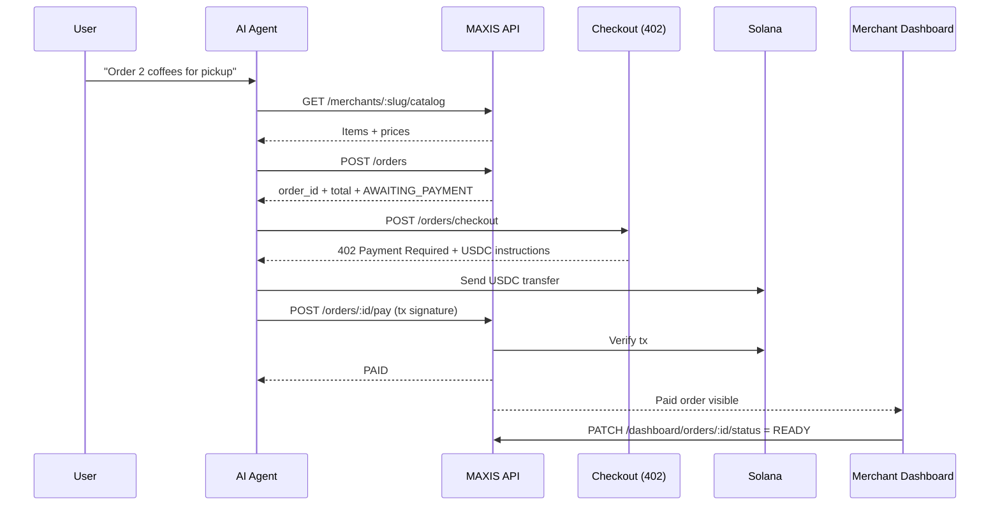

<div align="center">

# M.A.X.I.S.

### **M**odel-**A**gnostic **eX**change **&** **I**nventory **S**tandard

**Local businesses, agent-readable commerce, x402 checkout, USDC settlement on Solana**

[](https://solana.com)
[](https://www.x402.org/)
[](https://github.com/nikhlu07/MAXIS)

</div>

---

## One-line pitch

**MAXIS makes local businesses AI-orderable and machine-payable via structured commerce APIs + x402 on Solana.**

---

## Table of contents

- [Repository layout](#repository-layout)
- [Problem and solution](#problem-and-solution)
- [MVP scope](#mvp-scope)
- [System architecture](#system-architecture)
- [End-to-end flow](#end-to-end-flow)
- [API surface](#api-surface)
- [Order state model](#order-state-model)
- [Pricing hypothesis](#pricing-hypothesis)
- [Hackathon demo script](#hackathon-demo-script)
- [Frontend](#frontend)
- [References](#references)

---

## Repository layout

| Path | Purpose |
|------|---------|
| `README.md` | Root architecture, scope, API flow, demo narrative |
| `maxis-frontend/` | Frontend app + UI/UX docs |

---

## Problem and solution

### Problem

AI assistants are increasingly capable, but most local commerce is still human-only:

- menus/services are unstructured
- ordering flows are not deterministic for agents
- payment confirmation is not built for agent execution

### Solution

MAXIS provides a clean machine contract for local merchants:

1. structured catalog for agents
2. deterministic order APIs
3. x402 payment challenge
4. USDC verification on Solana
5. merchant dashboard with fulfillment status

---

## MVP scope

### In scope

- Merchant dashboard: catalog + incoming orders + status updates
- Agent flow: `catalog -> order -> checkout(402) -> pay -> status`
- Pickup-first fulfillment
- Solana USDC verification (devnet for hackathon)

### Out of scope (v1)

- Delivery partner network
- Full CMS plugin automation for every website stack
- Enterprise procurement/compliance suite

---

## System architecture

```text
User Intent
   |
   v
AI Assistant / Agent
   |
   v
M.A.X.I.S. API  <------>  Merchant Dashboard
   |
   +------> Solana (USDC payment verification)
   |
   +------> Database (merchants, catalog, orders, tx refs)
```

### Component view

```mermaid
graph LR
  U[User] --> A[AI Assistant / Agent]
  A --> C[Catalog API]
  A --> O[Order API]
  O --> P[Checkout API (HTTP 402)]
  A --> S[Solana USDC Transfer]
  S --> V[Payment Verifier]
  V --> DB[(Orders DB)]
  DB --> D[Merchant Dashboard]
```

---

## End-to-end flow



---

## API surface

### Agent-facing

| Method | Path | Purpose |
|--------|------|---------|
| `GET` | `/merchants/:slug/catalog` | Read machine-readable catalog |
| `POST` | `/orders` | Create order for selected items |
| `POST` | `/orders/checkout` | Return HTTP `402` with payment instructions |
| `POST` | `/orders/:id/pay` | Submit tx signature for verification |
| `GET` | `/orders/:id/status` | Poll lifecycle status |

### Merchant-facing

| Method | Path | Purpose |
|--------|------|---------|
| `POST` | `/auth/register` | Merchant onboarding |
| `POST` | `/auth/login` | Merchant authentication |
| `GET` | `/dashboard/orders` | Merchant order inbox |
| `PATCH` | `/dashboard/orders/:id/status` | Mark `ACCEPTED` / `READY` |
| `POST` | `/dashboard/catalog` | Catalog create/update |

---

## Order state model

```text
AWAITING_PAYMENT -> PAID -> ACCEPTED -> READY
                      |
                      -> CANCELLED (if expired/rejected)
```

---

## Pricing hypothesis

- `$29/month` + `$0.15` per successful order
- No fees on failed/cancelled orders
- Pilot pricing; subject to validation post-hackathon

---

## Hackathon demo script

1. Merchant uploads menu in dashboard.
2. Agent requests order from catalog.
3. Checkout returns HTTP `402 Payment Required`.
4. Agent pays USDC on Solana.
5. Payment is verified and order status changes to `PAID`.
6. Merchant marks order `READY` for pickup.

Core proof: **discover -> order -> 402 -> pay -> ready**.

---

## Frontend

Frontend implementation and setup details:

- [`maxis-frontend/README.md`](./maxis-frontend/README.md)

---

## References

- [x402](https://www.x402.org/)
- [Solana](https://solana.com)
- [Colosseum Frontier](https://colosseum.com/frontier)
