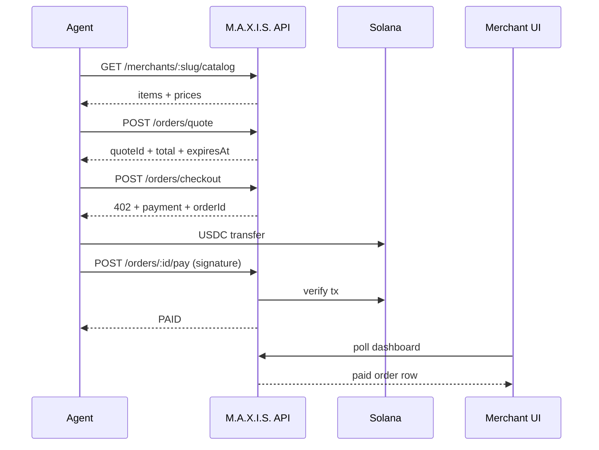

<div align="center">

# M.A.X.I.S.

### **M**odel-**A**gnostic **eX**change **&** **I**nventory **S**tandard

**Agent-callable storefronts for SMBs — canonical catalogs, x402 checkout, USDC on Solana**

[](https://colosseum.com/frontier)
[](https://solana.com)
[](https://github.com/nikhlu07/MAXIS)

**Repository:** [github.com/nikhlu07/MAXIS](https://github.com/nikhlu07/MAXIS) · *Personal account (no org) — same structure: root spec + `maxis-frontend/` for the web UI docs.*

[Live demo](https://your-demo-url.example) · [Demo video](https://youtube.com/your-video) · [Arena](https://arena.colosseum.org/hackathon)

</div>

---

## Table of contents

- [Repository layout (this monorepo)](#repository-layout-this-monorepo)
- [Executive summary](#executive-summary)
- [Problem & solution](#problem--solution)
- [What we build (v1)](#what-we-build-v1)
- [Why this wedge](#why-this-wedge)
- [System architecture](#system-architecture)
- [Payments: x402 + Solana](#payments-x402--solana)
- [API specification (reference)](#api-specification-reference)
- [Data model (conceptual)](#data-model-conceptual)
- [Repos & README strategy (split repos later)](#repos--readme-strategy-split-repos-later)
- [Build checklist (engineering)](#build-checklist-engineering)
- [Frontend (freelancer / teammate)](#frontend-freelancer--teammate)
- [Colosseum Frontier — submission checklist](#colosseum-frontier--submission-checklist)
- [Pitch & deck outline](#pitch--deck-outline)
- [Business model](#business-model)
- [Post-hackathon roadmap](#post-hackathon-roadmap)
- [Risks (honest)](#risks-honest)
- [References](#references)

---

## Repository layout (this monorepo)

Everything for judges & collaborators lives under **`nikhlu07/MAXIS`**:

| Path | Contents |
|------|----------|
| **`/`** (`README.md`) | Product narrative, architecture, APIs, hackathon checklist — **start here**. |
| **`/maxis-frontend/`** | Merchant dashboard **frontend specification** (`README.md` only until app code lands). |
| **`LICENSE`** | MIT (keep at repo root). |

Backend (`maxis-api`) and on-chain (`maxis-anchor`) can be added as sibling folders or separate repos later — cross-link from this root README when they exist.

---

## Executive summary

**M.A.X.I.S.** is infrastructure for **long-tail SMBs** left out of the shift to **AI-mediated commerce**.

| | |
|--|--|
| **What it is** | A **merchant dashboard** + **public agent API**: publish a trustworthy catalog, quote carts, emit **HTTP 402** payment instructions, verify **Solana USDC**, show **paid orders** live. |
| **Who buys** | Indie **cafés and quick-service** shops first (bounded menus, repeatable orders). |
| **Settlement** | **Non-custodial** — payout to merchant’s **public wallet** only. |
| **Honest MVP** | **Merchant-uploaded catalog** (manual/CSV/UI). Full “instant website → agent storefront” ingestion is **post-MVP**, not vapor. |
| **Hackathon anchor** | [Colosseum × Solana **Frontier**](https://colosseum.com/frontier) — submit via [Arena](https://arena.colosseum.org/hackathon). Demo typically on **solana-devnet**. |

---

## Problem & solution

### Problem

Consumers will order through **AI assistants**. Platforms like Uber / Amazon / Shopify already expose **deterministic commerce APIs**. Tens of millions of SMBs post menus as **PDFs, HTML, Instagram grids, or messy POS exports** — none of those are a **reliable machine contract**. Raw scraping breaks on price, inventory, and trust.

### Solution

Give every small shop:

1. **Canonical catalog API** agents can consume.  
2. **Quote → checkout → x402** flow with **verified USDC** on Solana.  
3. **Merchant UX** that takes minutes — menu + wallet + orders.

---

## What we build (v1)

| Layer | Deliverable |
|-------|----------------|
| **Merchant** | Dashboard: auth, CRUD catalog, payout **Solana address** (pubkey only), order list & fulfill. |
| **Agent** | `GET catalog` → `POST quote` → `POST checkout` (**402**) → agent pays SPL USDC → `POST …/pay` with **signature** (or webhook) → `PAID`. |
| **Optional** | [Helius](https://docs.helius.dev/) webhook `/webhooks/helius` updating `PENDING→PAID` when tx confirmed (keep **manual pay-submit** as fallback). |

**Explicitly NOT v1:** complex modifiers like Starbucks-style builds, delivery logistics, regulated goods, mainnet-only requirement, auto-ingest arbitrary websites **as the core claim**.

---

## Why this wedge

**Vertical:** independent cafés / juice / bakery / QSR (~20–80 SKUs).

**Why it fits:** repeatable purchase (“morning coffee”), simple pricing, bounded catalog, acceptable legal/fraud surface for MVP. **Dense single city:** hand onboarding + trust (Bangalore korridor / Mumbai corridor / Delhi NCR example zones in planning docs — pick **one narrative** consistently in deck vs pilots).

---

## System architecture

### High-level diagram

```
          User → AI Agent
                    │
                    ▼
           ┌────────────────────┐
           │ M.A.X.I.S. API      │
           │ (Node backend)      │
           └─────────┬──────────┘
                     │
       ┌─────────────┼─────────────┐
       ▼             ▼             ▼
   Postgres      HTTP 402        Solana RPC
   merchants     checkout        SPL USDC
   catalog                       verify
   orders              │
                       ▼
                 Helius webhook
                 (optional)
```

### End-to-end payment sequence (reference)



*(If GitHub does not render Mermaid in your browser, view raw or paste into [mermaid.live](https://mermaid.live).)*

---

## Payments: x402 + Solana

1. After **checkout**, API returns **HTTP 402 Payment Required** with JSON: amount, USDC mint, recipient (merchant ATA or agreed model), reference/memo.  
2. Agent submits **SPL USDC** transfer on **devnet** (hackathon) or mainnet later.  
3. Backend verifies **mint, amount, destination, idempotency** via RPC (primary).  
4. **Helius webhook** can mirror the same logic (nice-to-have acceleration).

**Demo devnet USDC mint** (common for submissions — confirm against your checklist when filing):

```
4zMMC9srt5Ri5X14GAgXhaHii3GnPAEERYPJgZJDncDU
```

**Mainnet USDC mint is different** — never hard-code wrong cluster.

---

## API specification (reference)

Base URLs: `http://localhost:3001/api` locally; production `https://api.<your-domain>/api`.

**Merchant routes:** `Authorization: Bearer <JWT>`.

### Agent-facing (public, rate-limited)

| Method | Path | Purpose |
|--------|------|---------|
| `GET` | `/merchants/:slug/catalog` | Full menu JSON |
| `POST` | `/orders/quote` | Price-locked quote + expiry |
| `POST` | `/orders/checkout` | Create pending order → **402** body |
| `POST` | `/orders/:orderId/pay` | Submit tx signature → verify → `PAID` |
| `GET` | `/orders/:orderId/status` | Poll order state |

### Merchant dashboard

| Method | Path | Purpose |
|--------|------|---------|
| `POST` | `/auth/register` | Onboard merchant |
| `POST` | `/auth/login` | JWT |
| `GET` | `/dashboard/orders` | List orders |
| `PATCH` | `/dashboard/orders/:id/status` | e.g. `FULFILLED` |
| `POST` | `/dashboard/catalog` | Bulk upsert catalog |
| *(align)* | `/dashboard/me` or `/settings` | Profile + payout pubkey |

### Webhooks

| Method | Path | Purpose |
|--------|------|---------|
| `POST` | `/webhooks/helius` | Optional auto-confirmation |

Exact JSON bodies: align across team in one **OpenAPI snippet** or **`docs/request-examples.json`** once the backend stabilizes.

---

## Data model (conceptual)

- **Merchant** — id, slug, email, hashed password, Solana pubkey, city, timestamps.  
- **CatalogItem** — merchant FK, title, USD price, availability, metadata.  
- **Quote** — merchant FK, line snapshot, total, expiry, consumed flag. *(Strongly recommended to avoid mismatch between quote and pay.)*  
- **Order** — merchant FK, quote FK, statuses `PENDING → PAID → FULFILLED | CANCELLED`, optional `solanaSignature`.  
- **OrderLine** — SKU ref, qty, unit price snapshot.

---

## Repos & README strategy (split repos later)

If you outgrow one repo, split **without losing clarity**:

| Repo | Role |
|------|------|
| **`nikhlu07/MAXIS`** *(this)* | Product README + optional monorepo docs |
| **`maxis-api`** *(new)* | Backend API + DB |
| **`maxis-anchor`** *(optional)* | Solana program |

**Personal GitHub profile:** pin **`MAXIS`** on [your profile](https://github.com/nikhlu07) so visitors see it first. *(Org-only features like org-wide README are optional — not required.)*

Cross-link each repo README → back to this root spec.

---

## Build checklist (engineering)

1. **Scope lock:** cafés + one city narrative + merchant-upload catalog.  
2. **Backend:** Postgres + Prisma migrations + seed merchant.  
3. **Auth JWT** bcrypt.  
4. **Agent endpoints** catalog → quote → checkout (402).  
5. **Pay path:** RPC verifier + optional Helius webhook (idempotent).  
6. **Frontend:** register/login/catalog/settings/orders + polling on orders.  
7. **CLI demo-agent** proving full loop.  
8. **Staging deploy:** Railway/Render + Vercel, CORS, env parity.  
9. **Judge quickstart:** 3 `curl`/script steps in repo root or wiki.  
10. **Recording + Arena** submission artifacts.

---

## Frontend (freelancer / teammate)

Keep it dumb-simple:

| Task | Detail |
|------|--------|
| Pages | Landing, register, login, orders (poll), catalog editor, settings (payout pubkey). |
| Env | **`NEXT_PUBLIC_API_URL`** pointing at staging API |
| Calls | Bearer token header after login; JSON everywhere |
| Done | Merchant can onboard menu, paste wallet, see paid orders flip, mark fulfilled |

Sync **exact URLs + sample JSON** with backend once per week.

---

## Colosseum Frontier — submission checklist

**Deadline:** **Monday, May 11, 2026** · [Frontier](https://colosseum.com/frontier) · submit on [Arena Hackathon hub](https://arena.colosseum.org/hackathon) · Sign in [`arena.colosseum.org/signin`](https://arena.colosseum.org/signin).

### Must attach

- [ ] Public GitHub (**this org / repos**)  
- [ ] **Live demo URL**  
- [ ] **2–3 min** unlisted YouTube (problem → live demo incl. merchant screen + HTTP 402 → business)  
- [ ] Pitch deck (PDF/Slides)  
- [ ] Screenshots: landing, dashboard w/ **paid** order, agent trace showing **402**

### Devnet fields (typical)

- [ ] Network: `solana-devnet`  
- [ ] USDC mint: `4zMMC9srt5Ri5X14GAgXhaHii3GnPAEERYPJgZJDncDU`  
- [ ] Example payment tx signature (real verify path, not mock)  
- [ ] Platform signing pubkey if you sign catalogs/quotes

### Arena housekeeping

- [ ] Team + timezone for all members  
- [ ] Weekly updates (Frontier requirement)  
- [ ] Final incognito smoke test on prod URL before submit

### Post-submit

- [ ] Share build + tag Colosseum / Solana community channels  
- [ ] DM 3–5 pilot cafés with demo link

---

## Pitch & deck outline

### 30-second pitch (script)

> Agentic commerce is becoming the new surface for demand. Big platforms expose agent-ready ordering APIs — the **long tail of SMBs** cannot afford that. **M.A.X.I.S.** publishes **canonical inventories** agents trust, emits **HTTP 402** settlements, and settles **Solana USDC** straight to merchants. Customers say *“two lattes from the cafe on the corner”* and it actually clears. Non-custodial. We start cafés → one dense city → expand once reliability proves out.

### 6-slide skeleton

1. **Problem** — AI traffic + broken SMB data contracts.  
2. **Solution** — dashboard + agent API + x402 + USDC verify.  
3. **Demo** — dashboard + trace with **402** + paid row.  
4. **Wedge + market** — cafés, frequency, menu size.  
5. **Business model** — SaaS + micro take rate.  
6. **Roadmap + team** — pilots + POS path.

**Avoid claiming** “we autoconvert any site day one.” Say **uploaded catalog v1**, ingestion later.

---

## Business model

| Stream | Draft |
|--------|--------|
| SaaS | **$29/mo** dashboard + agent endpoints |
| Success fee | **$0.15** or **0.5%** on agent-confirmed paid orders |
| Custody | **Zero** — merchant wallet only |
| Token | **None required** for core loop |

---

## Post-hackathon roadmap

| Horizon | Target |
|---------|--------|
| 0–30 days | 3–5 pilot merchants, **10+** agent-initiated paid orders |
| 60 days | Harden webhooks, analytics, better onboarding |
| 6 months | First POS integration research (Square/Toast), publish schema spec v0 |

---

## Risks (honest)

| Risk | Mitigation |
|------|------------|
| RPC / webhook flakiness | Dual path: user-submit signature + webhook; retries + backup RPC |
| Over-scoped Anchor program | Ship SPL transfer + verify first; program only if product requires it |
| Geographic story drift | One **deck city**; pilots can differ but don’t confuse judges |
| “Standard” naming | Deliver **working API + schema** before calling it an industry standard |

---

## References

- [Colosseum Frontier](https://colosseum.com/frontier)  
- [Arena hackathon hub](https://arena.colosseum.org/hackathon)  
- [Helius docs](https://docs.helius.dev/)  
- [x402](https://www.x402.org/)  

---

## License

Specify license when code ships (e.g. MIT / Apache-2.0). Planning text is intended for deck + Arena reuse.

---

<div align="center">

**Built for the agentic economy — [M.A.X.I.S. on GitHub](https://github.com/nikhlu07/MAXIS)**

</div>
