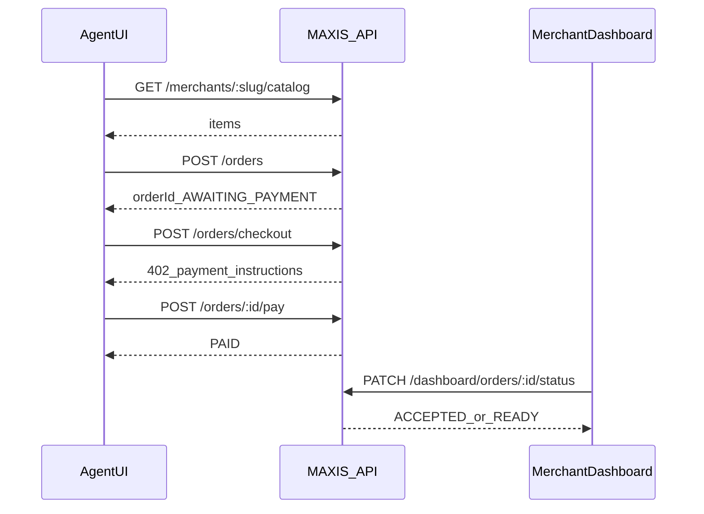

# MAXIS — Master project brief (single file)

**Use this file as the one canonical handoff** for humans, Notion, GitHub Gists, or other AI assistants. Repo paths below are relative to repository root unless marked absolute.

---

## How to paste this into another AI

Use a short lead-in like:

> Read and follow `docs/MAXIS_MASTER_BRIEF.md` in the MAXIS repo. Do not expand scope beyond MVP. Pickup-first only. If `SOLANA_RPC_URL`/`HELIUS_RPC_URL` is unset, pay verification is payload-only; when set, the API verifies USDC credits to the merchant ATA via `getParsedTransaction`.

---

## 0) Program and links

| Field | Value |
|-------|--------|
| **GitHub** | https://github.com/nikhlu07/MAXIS |
| **Program** | Colosseum × Solana Frontier — [Frontier](https://colosseum.com/frontier) · [Arena](https://arena.colosseum.org/hackathon) |
| **Team** | `[YOUR TEAM — names & roles]` |
| **Deadline** | `[CONFIRM IN ARENA]` |
| **Live frontend** | `[URL]` |
| **Live API** | `[URL]` |
| **Demo video** | `[URL]` |
| **Deck** | `[URL]` |

---

## 1) One-line pitch

MAXIS makes local businesses **AI-orderable and machine-payable** via **structured commerce APIs + HTTP `402 Payment Required` + Solana-aligned USDC flow + merchant fulfillment states**.

---

## 2) Thesis

Agents are moving from answers to actions. Local commerce is still **human UI + unstructured data**, so agents cannot trust menus, totals, or checkout. MAXIS is a **machine contract + workflow layer** for **pickup-first** local commerce.

---

## 3) Problem

| Pain | Why it matters |
|------|----------------|
| Unstructured catalogs | No stable API for SKUs/prices/availability |
| Human checkout | Not reproducible for agents |
| No payment boundary | Need explicit “pay before proceed” (`402`) |
| No fulfillment contract | Need `PAID → ACCEPTED → READY` (or cancel) |

---

## 4) Solution (what exists in repo)

1. `GET /merchants/:slug/catalog` — machine-readable catalog  
2. `POST /orders` — deterministic total; `AWAITING_PAYMENT`  
3. `POST /orders/checkout` — returns **HTTP 402** + `paymentRequestId`, amount, recipient, mint hint, expiry  
4. `POST /orders/:id/pay` — pay proof (`txSignature` + bounded fields)  
5. `GET /orders/:id/status` — poll state  
6. **Merchant dashboard** — catalog save, orders, **Agentic Checkout UI** (orders page): create order → show 402 JSON → submit pay proof → see `PAID` → merchant `ACCEPTED` / `READY`

### Honesty line (required in pitches)

**Payment verification modes:** With **`SOLANA_RPC_URL` or `HELIUS_RPC_URL`** set (and `ONCHAIN_PAY_VERIFY` not `false`), `POST /orders/:id/pay` checks the transaction on-chain: succeeded tx, merchant’s **USDC ATA** balance increased by at least the order total (`getParsedTransaction`). Without an RPC URL, the server only validates structured pay fields (legacy local demo). **`ONCHAIN_PAY_VERIFY=false`** keeps payload-only checks even if an RPC URL is set.

### Code map (repo-relative)

| Area | Path |
|------|------|
| Backend | [maxis-api/src/server.js](../maxis-api/src/server.js) |
| API quickstart | [maxis-api/README.md](../maxis-api/README.md) |
| Landing | [maxis-frontend/src/routes/index.tsx](../maxis-frontend/src/routes/index.tsx) |
| Developers | [maxis-frontend/src/routes/developers.tsx](../maxis-frontend/src/routes/developers.tsx) |
| Login / Register | [maxis-frontend/src/routes/login.tsx](../maxis-frontend/src/routes/login.tsx), [register.tsx](../maxis-frontend/src/routes/register.tsx) |
| Catalog | [maxis-frontend/src/routes/dashboard.catalog.tsx](../maxis-frontend/src/routes/dashboard.catalog.tsx) |
| Orders + Agentic UI | [maxis-frontend/src/routes/dashboard.orders.tsx](../maxis-frontend/src/routes/dashboard.orders.tsx) |
| API client | [maxis-frontend/src/lib/api.ts](../maxis-frontend/src/lib/api.ts) |
| Auth storage | [maxis-frontend/src/lib/auth.ts](../maxis-frontend/src/lib/auth.ts) |

---

## 5) Shipped checklist (status)

### Product

| Item | Status |
|------|--------|
| Marketing site | Done |
| Developer spec page | Done |
| Auth + API wiring | Done |
| Catalog + Save to API | Done |
| Orders + status actions | Done |
| Agentic Checkout UI | Done |

### Backend endpoints

| Endpoint | Status |
|----------|--------|
| `GET /health` | Done |
| `GET /merchants/:slug/catalog` | Done |
| `POST /orders` | Done |
| `POST /orders/checkout` → **402** | Done |
| `POST /orders/:id/pay` | Done (optional on-chain USDC verify via RPC) |
| `GET /orders/:id/status` | Done |
| `GET/PATCH /dashboard/orders…` | Done |
| `POST /dashboard/catalog` | Done |
| Structured errors | Done |

### Judge-facing proof

- [x] **402** visible in UI (JSON block)  
- [x] Lifecycle `AWAITING_PAYMENT → PAID → ACCEPTED → READY`  
- [x] Idempotency key on `/pay` (server cache)  
- [x] Out of scope stated: no delivery network v1; no “scrape every site” claim  

---

## 6) API surface (summary)

### Agent-facing

| Method | Path | Purpose |
|--------|------|---------|
| `GET` | `/merchants/:slug/catalog` | Catalog JSON |
| `POST` | `/orders` | Create order |
| `POST` | `/orders/checkout` | **402** + payment instructions |
| `POST` | `/orders/:id/pay` | Pay proof |
| `GET` | `/orders/:id/status` | Status |

### Merchant-facing

| Method | Path | Purpose |
|--------|------|---------|
| `POST` | `/auth/register` | Onboard |
| `POST` | `/auth/login` | Token |
| `GET` | `/dashboard/orders` | Inbox (Bearer) |
| `PATCH` | `/dashboard/orders/:id/status` | `ACCEPTED` / `READY` / `CANCELLED` |
| `POST` | `/dashboard/catalog` | Upsert catalog (Bearer) |

---

## 7) Order state machine

```text
AWAITING_PAYMENT → PAID → ACCEPTED → READY
                      |
                      → CANCELLED (where applicable)
```

---

## 8) Architecture (sequence)



**Persistence (MVP):** in-memory in `maxis-api` (replace with DB for production).

---

## 9) Competitive positioning (safe)

- **Stripe / x402 ecosystem:** validates machine payment patterns; often API / different rails.  
- **MAXIS:** **`402`-style handshake + local pickup workflow** (catalog, order, fulfillment), **Solana / USDC** story for Frontier.

Avoid: “nobody competes.” Use: “end-to-end local workflow + honest demo is the differentiator.”

---

## 10) Pricing (hypothesis)

`$29/mo + $0.15` per paid order — **unvalidated** until pilots.

---

## 11) Local run

**API**

```bash
cd maxis-api && npm install && npm run dev
# http://localhost:3001
```

**Frontend**

```bash
cd maxis-frontend && npm install && cp .env.local.example .env.local
# set VITE_API_BASE_URL=http://localhost:3001
npm run dev
```

**Demo merchant**

- Slug: `north-star-cafe`  
- Login: `demo@maxis.local` / `demo123`  
- Bearer for dashboard: server logs `demo-token` (aligned with demo auth)

---

## 12) Golden-path verification (API)

Preconditions: API running on `http://localhost:3001` (or your deployed base).

| Step | Expect |
|------|--------|
| `GET /health` | `200`, `{ ok: true }` |
| `POST /orders` | `201`, `AWAITING_PAYMENT` |
| `POST /orders/checkout` | **`402`**, JSON with `paymentRequestId`, `amount`, `recipient`, … |
| `POST /orders/:id/pay` | `200`, `PAID` |
| `POST /auth/login` | JWT-like token payload (demo) |
| `GET /dashboard/orders` | Bearer; order listed `PAID` |
| `PATCH …/status` | `ACCEPTED` then `READY` |
| `GET /orders/:id/status` | `READY` |

### Screenshot checklist (UI, for Arena / Notion)

1. Catalog page + **Save to API** success line  
2. Orders → **Agentic Checkout** with **402 JSON** visible  
3. Orders table row **PAID** + tx line if shown  
4. Same order **ACCEPTED** then **READY**  

After deploy, repeat against `[PROD_API]` and paste URLs in section 0.

---

## 13) Sample `curl` (optional)

Replace `BASE`, `OID`, values from live 402 response.

```bash
BASE=http://localhost:3001
# create order -> capture orderId OID
curl -s -X POST "$BASE/orders" -H "Content-Type: application/json" \
  -d '{"merchantSlug":"north-star-cafe","items":[{"itemId":"item_latte_sm","qty":2}]}'

curl -s -w "\n%{http_code}\n" -X POST "$BASE/orders/checkout" -H "Content-Type: application/json" \
  -d '{"orderId":"OID_HERE"}'

curl -s -X POST "$BASE/orders/OID_HERE/pay" -H "Content-Type: application/json" \
  -d '{
    "paymentRequestId":"PR_FROM_402",
    "txSignature":"demo_sig_here",
    "amount":"FROM_402",
    "recipient":"FROM_402",
    "asset":"USDC",
    "chain":"solana-devnet",
    "reference":"OID_HERE",
    "idempotencyKey":"demo_idem_001"
  }'
```

---

## 14) Demo script (2–3 min)

1. Problem: agents need contracts, not scraped HTML.  
2. Catalog → **Save to API**.  
3. Orders → Agentic UI: create order → **402 JSON** → pay proof → **PAID**.  
4. Merchant: **ACCEPTED → READY**.  
5. Close: pickup-first; delivery + RPC hardening next.

---

## 15) Risks and mitigations

| Risk | Mitigation |
|------|------------|
| Consumer wallet friction | Demo = agent/crypto path; hybrid later |
| Cold start | One demo merchant + scripted UI |
| Verification depth | Say MVP clearly; add RPC rules next |

---

## 16) Next 7 days

| Day | Task |
|-----|------|
| 1 | Deploy API + frontend; `VITE_API_BASE_URL` → prod API |
| 2 | Record demo |
| 3 | Screenshots (section 12) |
| 4 | Keep this file + README aligned |
| 5 | Arena submission package |

---

## 17) Claims discipline

Do **not** claim without proof:

- Wallet vendor partnerships  
- Mainnet production grade  
- “Instant perfect crawl” of any website  
- Built-in delivery marketplace  

---

## 18) Other docs (supporting only)

| File | Role |
|------|------|
| [README.md](../README.md) | Engineering overview + diagrams |
| [maxis-api/README.md](../maxis-api/README.md) | API runbook |
| [maxis-frontend/README.md](../maxis-frontend/README.md) | Frontend deploy / setup |

---

*End of master brief.*
